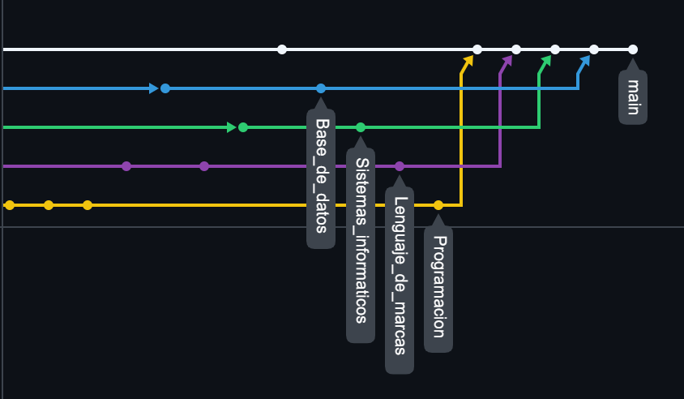
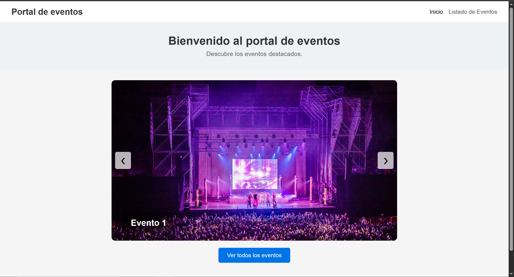

# Minsait
Proyecto de Carlos Nerí Campos Pérez.
El proyecto se divide en 4 carpetas.
- doc: Enseña como instalar una máquina virtual de Windows 10 en VirtualBox. Además de abrir un servidor web local con xampp y publicar una página web.
- lenguaje_de_marcas: Una página web creada usando html, css y javascript que muestra distintos eventos en un carrusel. Se podrán listar todos los eventos y ver información detallada en distintas páginas estáticas.
- programacion: Un programa que permite gestionar eventos. Permite creación de organizadores para que creen eventos y usuarios que se inscribiran a estos.
- sql: Según lo que pedía el cliente se crea una base de datos. Primero el diagrama entidad-relación, luego modelo relacional y las tablas con las descripciones de las entidades. Por último un script de instalación y la base de datos ya creada para importarla en el servidor directamente. 
Para la parte de entornos de desarrollo y uso de git estas han sido las ramas creadas.
 
Y esta sería la página principal de la parte de lenguaje de marcas, el carrusel.
