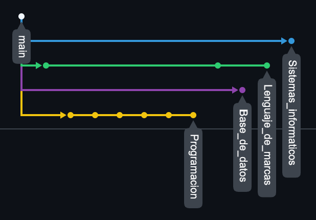
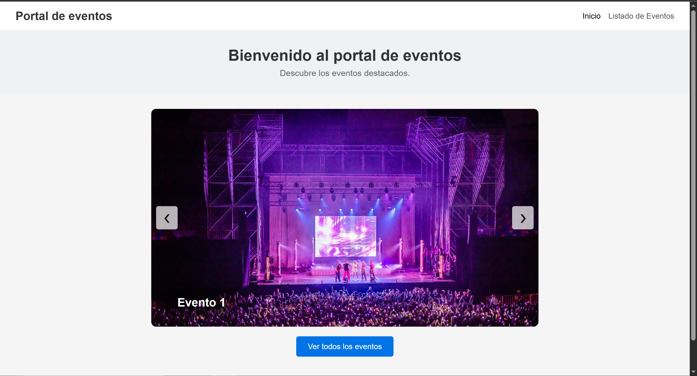

# Minsait
Repositorio del proyecto en Minsait de Carlos Nerí Campos Pérez 
En este proyecto aprenderemos sobre Lenguaje de marcas, Bases de datos, Programación en Java, Uso de máquinas virtuales y servidores web y Entornos de desarrollo o como usar correctamente Github.

